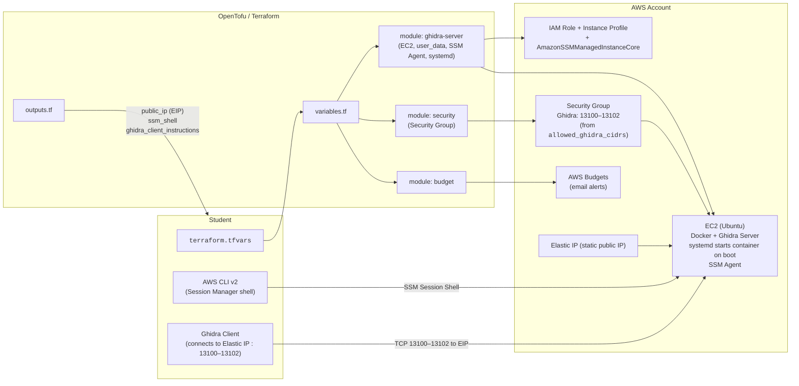

# Ghidra Server on AWS Using IaC (OpenTofu/Terraform)

Spin up a single EC2 instance running a Ghidra **server** in Docker, with users seeded from IaC.

_NOTE_: This project is **not supported by or affiliated with Georgia Institute of Technology**.  
I am a student in CS6747 (Advanced Malware Analysis) and created this to help classmates easily deploy a Ghidra server for team collaboration.

Credit to [Cryptophobia](https://github.com/Cryptophobia/docker-ghidra-server-aws) for inspiration.

## Contents

- [Prerequisites](#prerequisites)
- [Quick start](#quick-start)
- [What it creates](#what-it-creates)
- [Configuration](#configuration)
- [Connect to the server](#connect-to-the-server)
- [Troubleshooting](#troubleshooting)
- [Security notes](#security-notes)
- [Architecture](#architecture)

## Prerequisites

- **AWS account** with permission to create EC2, IAM roles, and Security Groups
- **OpenTofu** (`tofu`) _or_ **Terraform** (`terraform`)
- **AWS CLI v2** (`aws --version`)

## Quick start

1. **Clone** this repo and `cd` into it:

   ```bash
   git clone https://github.com/benjaminwilcox/ghidra-server-iac.git
   cd ghidra-server-iac
   ```

2. Copy the example variables and edit:

   ```bash
   cp terraform.tfvars.example terraform.tfvars
   ```

3. **Authenticate** to AWS:

   ```bash
   aws configure
   ```

4. **Plan & apply**:

   ```bash
    tofu init
    tofu apply   # type 'yes' when prompted
   ```

   > If using terraform, replace any `tofu` commands with `terraform`

5. Grab the **outputs** after apply (public IP/DNS):

   ```bash
   tofu output
   ```

6. If necessary, to terminate the instance and destroy all resources, including the elastic ip:

   ```bash
   tofu destroy
   ```

## What it creates

- An **IAM role** and instance profile for the EC2 server.
- One **EC2 instance** using an Ubuntu AMI and `instance_type`.
- A dedicated **Security Group** that allows:
  - **TCP 13100–13102** (Ghidra server) only from the CIDRs you specify (`allowed_ghidra_cidrs`).
- An **Elastic IP** to keep a static public IP across stop/starts:
  - Outputs the static IP as public_ip.
  - Note: idle/unattached EIPs cost $0.005/hr ($3.60/mo).
- Cloud-init **user data** that:
  - Installs Docker and dependencies.
  - Builds and runs a Ghidra server container.
  - Seeds user accounts from `ghidra_users`.
  - Registers a `systemd` service for automatic startup.
- An **AWS Budget** with email alerts, if `enable_budget = true`.
  - Sets a monthly USD limit.
  - Sends email alerts when forceasted spend exceeds 80% and when actual spend exceeds 100%
  - Budgets are account-wide.
  - Budgets do not stop resources. You must still run `tofu destroy`.

**Outputs** (after apply)

- `ghidra_server_ip` — Public IP address of the Ghidra server.
- `ssm_shell` — Copy-pasteable SSM command to connect to your instance.
- `ghidra_client_instructions` — Step-by-step instructions for connecting from the Ghidra GUI client.

## Configuration

The repo defines (at minimum) the following variables (see [variables.tf](./variables.tf) for details).
For a starter config, copy [terraform.tfvars.example](./terraform.tfvars.example) → `terraform.tfvars` and edit the required fields below:

- `ghidra_users` — add your and your teammate's names.

- `allowed_ghidra_cidrs` — add your and your teammate's IPs.

- `billing_emails` — your school email for AWS budget alerts.

## Connect to the server

1. **SSM** into the instance:

   ```bash
   aws ssm start-session --target <instance-id>
   sudo su - ubuntu
   ```

2. Verify the service:

   ```bash
   sudo docker ps
   sudo docker logs ghidra-server --tail=100
   ```

3. **Ghidra client** → **Server**

   - Server Name: `<ghidra_server_ip>`
   - Port Number: `13100`
   - Users: the ones you set in `ghidra_users`
   - Password: `changeme` (**must be changed immediately after first login**).

## Troubleshooting

**No valid credential sources found / no EC2 IMDS role found**

- You’re not logged in to AWS locally. Test with `aws sts get-caller-identity`.

**Ghidra port unreachable**

- Ensure Security Group allows **TCP 13100** from your client IP(s).
- Check to see if the server is running properly: `sudo docker ps` and `sudo docker logs ghidra-server`.

**AMI not found**

- AMI IDs are region-specific. Pick an Ubuntu AMI for your **region**.

## Security notes

- Restrict CIDRs to only what you need.
- Change the default password for seeded users immediately.

## Architecture


